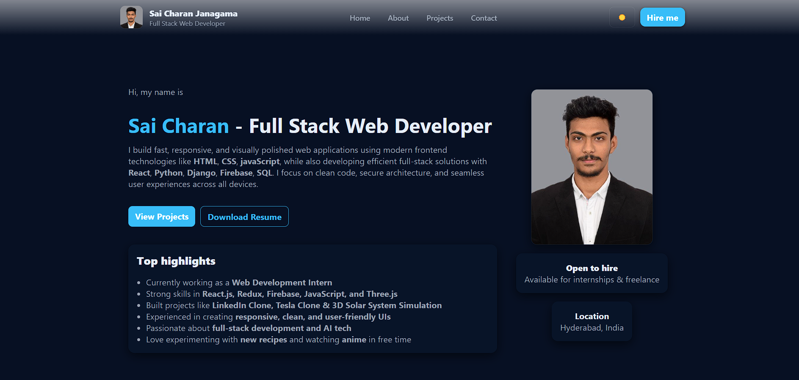

<h1 align="center">💼 Sai Charan | Portfolio</h1>

<p align="center"> 
   
   
  


</p> 

<p align="center"> 
  A clean, modern, and fully responsive <b>Personal Portfolio Website</b> built as part of my <b>Internship Project</b>. 
  This portfolio showcases my <b>skills, projects, experience, and achievements in a</b> visually appealing and professional manner. 
  Designed using <b>HTML, CSS, and JavaScript</b> with smooth animations and a mobile-first approach. 
</p>

---

## 🚀 Live Demo  
🔗 **View Project:** [💼 Sai Charan | Portfolio](https://saicharanjanagama.github.io/Portfolio/)

📸 **Preview:**  
<p align="center">
  
</p>

---

## 🎯 Features

- 👋 Hero Section with introduction & role
- 🧑‍💻 About Me section describing background & interests
- 🛠 Skills Section with categorized skill badges
- 🚀 Projects Showcase with images, descriptions & links
- 🎓 Experience / Education Timeline
- ✉️ Contact Form with email integration
- 🌙 Dark & Light Theme Toggle
- 📱 Fully Mobile Responsive Design
- 🎨 Modern UI with smooth hover effects & transitions
- 🔄 Interactive JavaScript for tabs, modal popups & theme switching

---

## 🛠️ Technologies Used

- **HTML5**  
  *(Semantic structure, Accessibility-friendly layout)*  
- **CSS3**  
  *(Responsive grid & flexbox, Custom color themes, Typography & spacing system, Animations & transitions)*  
- **JavaScript**  
  *(Theme toggling, Modal popup for project details, Tab switching for About section, Mobile navigation toggle)*  
- **LocalStorage API**  
  *(Optional persistence of tasks in browser)*  

---

📂 Project Structure

Portfolio - Sai Charan/
│── index.html
│── css/
│    └── style.css
│── js/
│    ├── script.js
     ├── contactForm.js
│── images/
│    └── (project thumbnails, profile image)
│── README.md


---

## 🚀 How to View

To view the project locally:  
```bash
open index.html
```

---

## 👨‍💻 Author

It’s me — **Sai Charan Janagama** 😄<br>
🎓 Computer Science Graduate | 🌐 Aspiring Full Stack Developer<br>
📧 [Email Me](saic89738@gmail.com) ↗<br>
🔗 [LinkedIn](https://www.linkedin.com/in/saicharanjanagama/) ↗<br>
💻 [GitHub](https://github.com/SaiCharanJanagama) ↗

---

## 💬 Feedback

If you have any feedback or suggestions, feel free to reach out!  
Your input helps me improve 🚀
